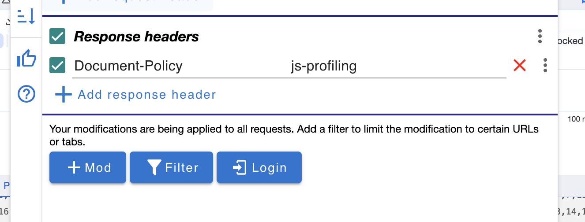

# Angular + Sentry

## Installation

https://docs.sentry.io/platforms/javascript/angular/

### Deploying

`nvm use`

`npm install`

`npm install -g @sentry/cli`

The following command is defined in [package.json](https://github.com/sentry-demos/angular/blob/master/package.json#L12-L13) and will build, create release, upload source maps and deploy:

`npm run deploy` 

note: predeploy runs as part of deploy where create_env is used

note: a .env file must be made in order to store the relative variable value provided by the Sentry CLI 

## Error Monitoring

## Performance Monitoring

## Enable Profiling
In order to enable profiling, please use an extension that allows you to modify the document response headers (make sure you create a rule to modify RESPONSE headers, not request headers!). An example of an extension like that for Chrome is [modheader](https://modheader.com/).

